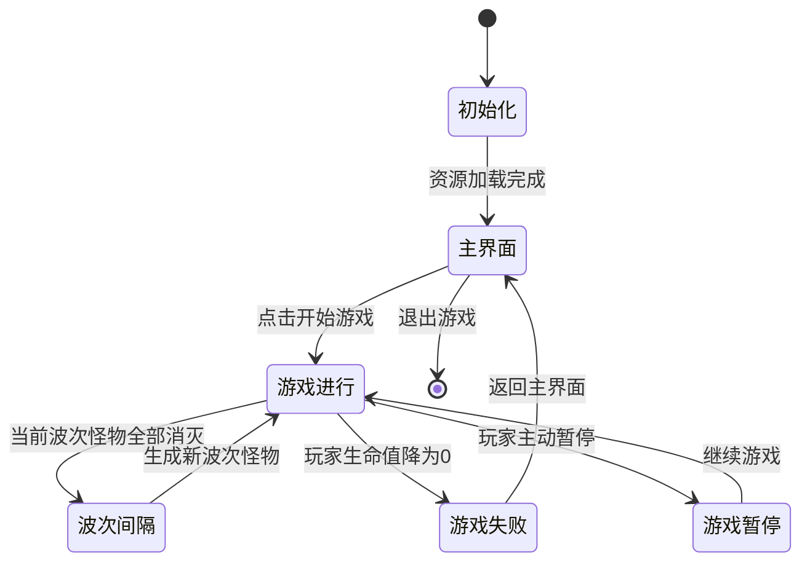
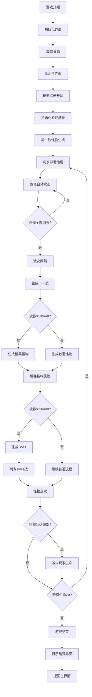

# 游戏流程文档 - Merge Shooter

## 游戏概述

Merge Shooter 是一款结合了合并机制和塔防射击玩法的休闲游戏。玩家通过合并相同等级的炮塔来提升火力，同时抵御不断来袭的怪物波次。

## 核心玩法机制

### 1. 炮塔合并系统
- **拖拽合并**：玩家可以拖拽炮塔到相同等级的炮塔上进行合并
- **等级提升**：两个相同等级的炮塔合并后升级为更高一级的炮塔
- **最高等级限制**：炮塔最高等级为8级，超过上限的合并会被拒绝
- **合并公式**：Lv.X + Lv.X = Lv.(X+1)

### 2. 战斗系统
- **自动攻击**：放置在射击区域的炮塔会自动攻击范围内的怪物
- **目标选择**：优先攻击距离最近的怪物
- **攻击属性**：每个炮塔有攻击力、攻击速度这三个属性
- **伤害计算**：怪物生命值减少等于炮塔攻击力数值

### 3. 怪物系统
- **波次管理**：游戏按波次生成怪物，每波之间有间隔时间
- **怪物类型**：
  - 普通怪物（每波5个）
  - 精英怪物（每10波出现）
  - Boss怪物（每20波出现）
- **属性成长**：怪物生命值和攻击力随波数增加而提升

### 4. 经济系统
- **初始金币**：玩家起始拥有200金币
- **炮塔购买**：通过底部按钮消耗金币购买新炮塔
- **金币消耗**：购买炮塔需要消耗一定数量的金币

## 游戏状态转换

## 游戏区域划分

### 1. 炮塔区域（下方）
- **功能**：存放和管理炮塔，进行合并操作
- **布局**：2行×6列的网格布局，共12个槽位
- **交互**：支持拖拽炮塔进行合并或重新排列

### 2. 射击区域（中下方）
- **功能**：放置激活的炮塔进行战斗
- **布局**：6个射击点位，与炮塔区域列数对齐
- **规则**：只有放置在此区域的炮塔才能攻击怪物

### 3. 怪物路径区域（上方）
- **功能**：怪物移动和战斗的主要区域
- **特点**：怪物按照预定路径移动，炮塔在此区域内攻击

### 4. 底部按钮区域
- **功能**：提供游戏操作按钮
- **按钮类型**：
  - 购买炮塔按钮
  - 升级塔功能按钮（点击对购买炮塔按钮的随机性有改变）
  - 商店按钮（点击看广告增加金币）

## 胜利与失败条件

### 胜利条件
- **生存模式**：在无限波次中生存尽可能长的时间
- **高分挑战**：获得更高的分数和波次记录

### 失败条件
- **玩家生命归零**：当怪物突破防线到达底部时，玩家生命值减少
- **生命值为0时**：游戏结束，显示失败界面

## 用户交互操作

### 触摸/鼠标操作
1. **拖拽炮塔**：
   - 从炮塔区域拖拽炮塔到另一个相同等级炮塔上进行合并
   - 拖拽炮塔到射击区域进行部署
   - 在射击区域内拖拽炮塔重新排列

2. **点击按钮**：
   - 点击底部按钮购买新炮塔
   - 点击升级购买炮塔按钮
   - 点击广告拿金币

3. **界面交互**：
   - 查看金币数量和玩家生命值
   - 观察当前波次和怪物状态
   - 监控炮塔攻击效果

### 游戏反馈
- **视觉反馈**：
  - 炮塔合并时的动画效果
  - 怪物被击中时的爆炸特效
  - 金币数量和生命值的实时更新

- **音效反馈**：
  - 炮塔射击音效
  - 怪物被消灭音效
  - 合并成功音效

## 游戏流程图

## 特殊机制说明

### 1. 波次系统
- **波次递增**：每消灭一波怪物后，波数增加1
- **难度递增**：随着波数增加，怪物属性逐渐增强
- **特殊波次**：每10波出现精英怪，每20波出现Boss

### 2. 合并策略
- **最优合并**：建议优先合并高等级炮塔以获得更强火力
- **布局规划**：合理安排炮塔位置，避免空间浪费
- **资源管理**：平衡购买新炮塔和升级现有炮塔的资源分配

### 3. 战斗策略
- **火力集中**：将高等级炮塔部署在关键位置
- **覆盖范围**：确保射击区域有足够火力覆盖
- **及时升级**：随着怪物增强，及时提升炮塔等级

## 技术实现要点

### 1. 渲染系统
- **Canvas 2D**：使用HTML5 Canvas进行游戏渲染
- **精灵图动画**：怪物和炮塔使用序列帧动画
- **粒子效果**：爆炸和射击特效使用粒子系统

### 2. 物理系统
- **碰撞检测**：使用矩形碰撞检测算法
- **路径计算**：怪物采用简单的之字形移动算法
- **范围检测**：炮塔攻击范围使用圆形区域检测

### 3. 状态管理
- **游戏状态**：统一管理游戏进行、暂停、结束等状态
- **资源管理**：集中管理图片、音效等资源加载和使用
- **事件系统**：使用发布-订阅模式处理游戏事件

---

*本文档基于Merge Shooter游戏源代码分析编写，涵盖了游戏的核心玩法、流程机制和交互设计。*